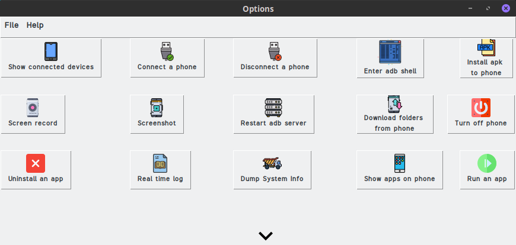
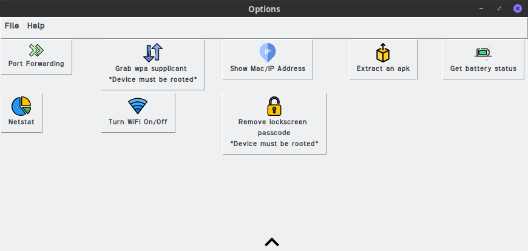

# PhoneSploitGui

**PhoneSploitGui is a GUI version of the CLI tool PhoneSploit used to manage android devices that have USB Debugging enabled. The program was originally created by metachar but is no longer available. Metachar seems to have deleted his Github account as well. This is the only GUI version of the program out there.
There are 20+ functions to PhoneSploitGui. PhoneSploitGui uses ADB, Python and Java which must be installed to your device in order for PhoneSploitGui to run. Works for Windows, Linux and Mac OS.**

_PhoneSploitGui WILL appear to be frozen. However it's not. I made this using tkinter which doesn't utilize threads which would have it be able to do more than 1 task. Because of this, you have to wait for the task to finish first before using the program again. Graphics will appear weird when a task is in process. I'll use a better gui toolkit next time._

# New Update v1.1
* **Screenshot & Screen Record now delete the picture/video from the targets device after taking it** 
* **Rephrasing pop-up messages** 
* **Fixed bug where the Screen Recording pop-up stays open after clicking "OK"** 
* **Fixed bug where error message appears at bottom left corner of the screen** 
* **Released Windows setup file to simplify installation process** 

# Installing PhoneSploitGui
# Windows

* **Open your command prompt but clicking the Windows start menu then type ``cmd``. Make sure to preform these commands in the root of the folder**
* **Type ``pip install -r requirments.txt``. This will install all the libraries needed for PhoneSploitGui to run.**
* **Now you can run the program by typing ``python PhoneSploitGui.py``.**

# Linux

* **Install adb and python3 using ``sudo apt-get install adb python3``.**
* **Next, type ``pip3 install -r requirements.txt`` which will install all the necessary libraries.**
* **Finally, type ``sudo python3 PhoneSploitGui.py``.**
